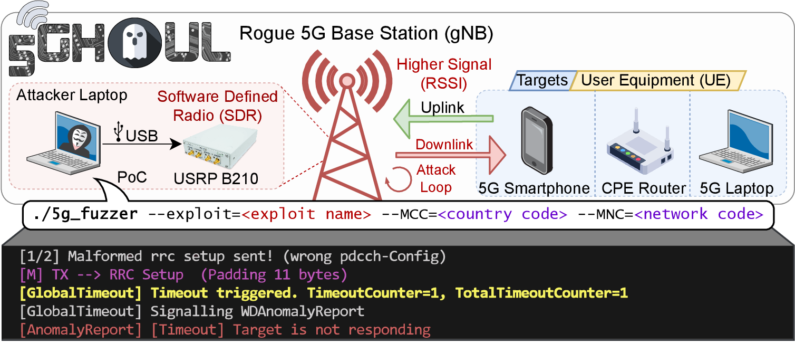

# 5GRAN Fuzzing

## ahmad@eurecom.fr

## IABG

> Proof of Concept (PoC) of 5G NR Attacks against commercial smartphones, CPE routers, USB Modems, etc. Fuzzer included⚡. 5Ghoul is family of implementation-level 5G DoS vulnerabilities

------

